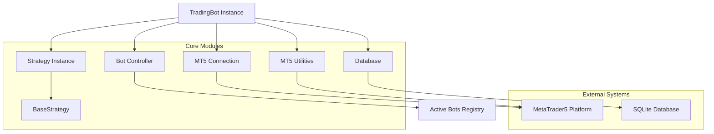
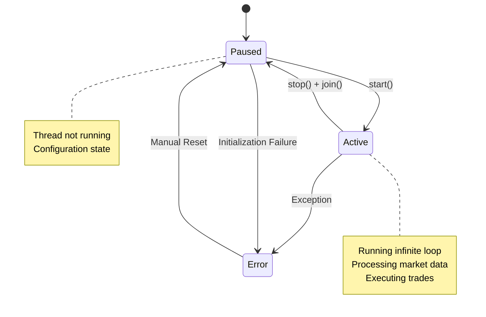
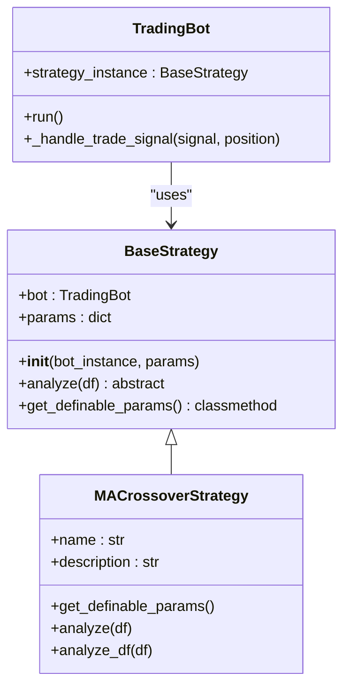
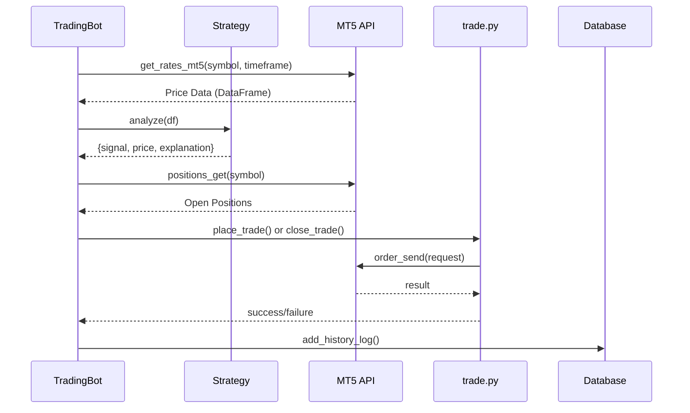

# Trading Bot Architecture

<cite>
**Referenced Files in This Document**   
- [trading_bot.py](file://core/bots/trading_bot.py#L0-L169)
- [base_strategy.py](file://core/strategies/base_strategy.py#L0-L28)
- [ma_crossover.py](file://core/strategies/ma_crossover.py#L0-L60)
- [strategy_map.py](file://core/strategies/strategy_map.py#L0-L27)
- [trade.py](file://core/mt5/trade.py#L0-L152)
- [mt5.py](file://core/utils/mt5.py#L0-L144)
- [controller.py](file://core/bots/controller.py#L0-L176)
- [queries.py](file://core/db/queries.py)
</cite>

## Table of Contents
1. [Introduction](#introduction)
2. [Core Architecture Overview](#core-architecture-overview)
3. [TradingBot Class Design](#tradingbot-class-design)
4. [State Management and Threading](#state-management-and-threading)
5. [Signal Processing and Strategy Integration](#signal-processing-and-strategy-integration)
6. [Order Execution and Trade Management](#order-execution-and-trade-management)
7. [Code Example: MA Crossover Strategy](#code-example-ma-crossover-strategy)
8. [Lifecycle Control and Controller Integration](#lifecycle-control-and-controller-integration)
9. [Performance and Reliability Considerations](#performance-and-reliability-considerations)

## Introduction
The TradingBot class in the quantumbotx system represents a core autonomous trading agent that integrates market data analysis, strategy execution, and order management within a thread-safe, event-driven architecture. Built on Python's threading module and MetaTrader5 (MT5) API, the bot continuously monitors financial markets, generates trading signals through pluggable strategies, and executes trades with configurable risk parameters. This document provides a comprehensive analysis of its object-oriented design, state management, integration patterns, and operational workflow.

**Section sources**
- [trading_bot.py](file://core/bots/trading_bot.py#L0-L169)

## Core Architecture Overview



**Diagram sources**
- [trading_bot.py](file://core/bots/trading_bot.py#L0-L169)
- [controller.py](file://core/bots/controller.py#L0-L176)
- [mt5.py](file://core/utils/mt5.py#L0-L144)

**Section sources**
- [trading_bot.py](file://core/bots/trading_bot.py#L0-L169)
- [controller.py](file://core/bots/controller.py#L0-L176)

## TradingBot Class Design

The TradingBot class follows a robust object-oriented design pattern, inheriting from Python's `threading.Thread` to enable concurrent execution. It encapsulates all necessary attributes for autonomous trading operations:

**Key Attributes:**
- `id`: Unique identifier used as magic number for MT5 position tracking
- `name`: Human-readable bot name for identification
- `market`: Financial instrument symbol (e.g., "EURUSD")
- `risk_percent`: Percentage of account balance to risk per trade
- `sl_pips`: Stop-loss distance in pips (or ATR multiplier)
- `tp_pips`: Take-profit distance in pips (or ATR multiplier)
- `timeframe`: Chart timeframe for analysis (e.g., "H1", "M15")
- `check_interval`: Frequency (seconds) between market analysis cycles
- `strategy_name`: Identifier for strategy selection via STRATEGY_MAP
- `strategy_params`: Dictionary of strategy-specific configuration parameters
- `market_for_mt5`: Verified MT5 symbol name after normalization
- `status`: Operational state ("Aktif", "Dijeda", "Error")
- `last_analysis`: Latest signal result with explanation
- `_stop_event`: Threading event for graceful shutdown
- `strategy_instance`: Instantiated strategy object
- `tf_map`: Timeframe mapping dictionary for MT5 API compatibility

The class constructor initializes these attributes and establishes the threading foundation, while delegating strategy instantiation to the runtime phase within the `run()` method.

**Section sources**
- [trading_bot.py](file://core/bots/trading_bot.py#L15-L45)

## State Management and Threading



**Diagram sources**
- [trading_bot.py](file://core/bots/trading_bot.py#L47-L169)

The TradingBot implements thread-safe state management through Python's `threading.Event` mechanism. The `_stop_event` serves as a synchronization primitive that allows external components to signal the bot to terminate gracefully.

**State Transitions:**
- **Initialization**: Bot starts in "Dijeda" (Paused) status
- **Activation**: `start()` method inherited from Thread begins execution
- **Running**: `run()` method enters infinite loop, status changes to "Aktif" (Active)
- **Stopping**: `stop()` sets `_stop_event`, causing loop exit
- **Termination**: Thread completes, status resets to "Dijeda"

The `is_stopped()` method provides a thread-safe way to check the termination signal state, enabling clean shutdown procedures. This design ensures that the bot can be controlled from external interfaces without race conditions.

**Section sources**
- [trading_bot.py](file://core/bots/trading_bot.py#L112-L123)

## Signal Processing and Strategy Integration



**Diagram sources**
- [base_strategy.py](file://core/strategies/base_strategy.py#L0-L28)
- [ma_crossover.py](file://core/strategies/ma_crossover.py#L0-L60)
- [trading_bot.py](file://core/bots/trading_bot.py#L0-L169)

The signal processing workflow follows a modular design pattern using the Strategy pattern. The `run()` method implements an infinite loop that:

1. Verifies the market symbol using `find_mt5_symbol()` from MT5 utilities
2. Initializes the strategy instance via `STRATEGY_MAP` lookup
3. Retrieves market data using `get_rates_mt5()` with specified timeframe
4. Passes data to the strategy's `analyze()` method
5. Processes the resulting signal (BUY/SELL/HOLD)
6. Executes appropriate trade actions
7. Sleeps for `check_interval` seconds before next iteration

The `BaseStrategy` abstract class defines the contract for all trading strategies, requiring implementation of the `analyze()` method that returns a standardized result dictionary containing the signal, price, and explanation.

**Section sources**
- [trading_bot.py](file://core/bots/trading_bot.py#L47-L109)
- [base_strategy.py](file://core/strategies/base_strategy.py#L0-L28)

## Order Execution and Trade Management



**Diagram sources**
- [trading_bot.py](file://core/bots/trading_bot.py#L142-L167)
- [trade.py](file://core/mt5/trade.py#L0-L152)
- [mt5.py](file://core/utils/mt5.py#L0-L144)

The TradingBot handles order execution through a sophisticated error-resilient mechanism:

**Trade Execution Process:**
- Uses `place_trade()` and `close_trade()` functions from `core.mt5.trade`
- Implements dynamic lot sizing based on account balance and risk percentage
- Calculates stop-loss and take-profit levels using ATR (Average True Range)
- Employs FOK (Fill or Kill) order filling policy for immediate execution
- Uses GTC (Good Till Cancelled) order time policy

**Error Handling:**
- Comprehensive try-except blocks around critical operations
- Automatic retry logic with exponential backoff on failure
- Detailed logging of error codes and messages from MT5
- Status updates to reflect error conditions in UI
- Trade confirmation through MT5 result codes

The `_handle_trade_signal()` method implements position management logic that ensures only one position per bot (identified by magic number) exists at any time, automatically closing opposing positions before opening new ones.

**Section sources**
- [trading_bot.py](file://core/bots/trading_bot.py#L142-L167)
- [trade.py](file://core/mt5/trade.py#L0-L152)

## Code Example: MA Crossover Strategy

```python
# Example instantiation of TradingBot with MA Crossover strategy
bot = TradingBot(
    id=1001,
    name="MA Crossover Bot",
    market="EURUSD",
    risk_percent=1.0,
    sl_pips=2.0,  # ATR multiplier
    tp_pips=3.0,  # ATR multiplier
    timeframe="H1",
    check_interval=60,
    strategy="MA_CROSSOVER",
    strategy_params={
        "fast_period": 20,
        "slow_period": 50
    },
    status="Dijeda"
)

# Start the bot thread
bot.start()

# Monitor analysis results
while bot.is_alive():
    analysis = bot.last_analysis
    print(f"Signal: {analysis['signal']}, Explanation: {analysis['explanation']}")
    time.sleep(10)
```

The MA Crossover strategy detects trend changes by monitoring the intersection of two moving averages. When the fast MA crosses above the slow MA, it generates a BUY signal (Golden Cross); when it crosses below, it generates a SELL signal (Death Cross). The strategy is configured through parameters that define the periods of the moving averages.

**Section sources**
- [ma_crossover.py](file://core/strategies/ma_crossover.py#L0-L60)
- [strategy_map.py](file://core/strategies/strategy_map.py#L0-L27)

## Lifecycle Control and Controller Integration

```mermaid
flowchart TD
A[API Request] --> B{Action}
B --> C[Start Bot]
B --> D[Stop Bot]
B --> E[Update Bot]
C --> F[controller.mulai_bot()]
F --> G[queries.get_bot_by_id()]
G --> H[TradingBot()]
H --> I[bot.start()]
I --> J[active_bots[bot_id]]
J --> K[queries.update_bot_status('Aktif')]
D --> L[controller.hentikan_bot()]
L --> M[active_bots.pop(bot_id)]
M --> N[bot.stop()]
N --> O[bot.join(timeout=10)]
O --> P[queries.update_bot_status('Dijeda')]
E --> Q[controller.perbarui_bot()]
Q --> R[Stop if running]
R --> S[Update DB]
S --> T[Restart if needed]
```

**Diagram sources**
- [controller.py](file://core/bots/controller.py#L0-L176)
- [trading_bot.py](file://core/bots/trading_bot.py#L0-L169)

The TradingBot lifecycle is managed by the `BotController` which provides a centralized interface for bot management:

**Lifecycle Methods:**
- `start()`: Inherited from Thread, begins execution of `run()`
- `stop()`: Sets `_stop_event` to signal graceful shutdown
- `join()`: Waits for thread completion (used in controller)

The controller maintains an `active_bots` dictionary that maps bot IDs to running instances, enabling centralized monitoring and control. It handles API requests, database interactions, and thread lifecycle management, ensuring that bot states remain consistent across the application.

**Section sources**
- [controller.py](file://core/bots/controller.py#L0-L176)
- [trading_bot.py](file://core/bots/trading_bot.py#L100-L111)

## Performance and Reliability Considerations

The TradingBot architecture incorporates several performance and reliability features:

**Low-Latency Processing:**
- Efficient data retrieval with optimized MT5 API calls
- Minimal processing overhead in the main loop
- Configurable check intervals to balance responsiveness and resource usage
- Pre-calculated timeframe mappings to avoid repeated lookups

**Memory Management:**
- Limited data retention (250 bars) to prevent memory bloat
- Efficient pandas DataFrame operations
- Proper cleanup of temporary objects in loops
- Thread-local storage isolation

**Reliability Features:**
- Comprehensive error handling with detailed logging
- Automatic symbol name resolution for MT5 compatibility
- Database transaction safety for state persistence
- Graceful degradation on connectivity issues
- Atomic operations for thread-safe state changes

**Optimization Opportunities:**
- Implement data caching to reduce redundant MT5 calls
- Add circuit breaker pattern for repeated failures
- Introduce adaptive check intervals based on market volatility
- Implement connection pooling for MT5 sessions

The design prioritizes stability over maximum performance, ensuring reliable operation during extended trading sessions while maintaining responsiveness to market conditions.

**Section sources**
- [trading_bot.py](file://core/bots/trading_bot.py#L47-L169)
- [mt5.py](file://core/utils/mt5.py#L0-L144)
- [trade.py](file://core/mt5/trade.py#L0-L152)