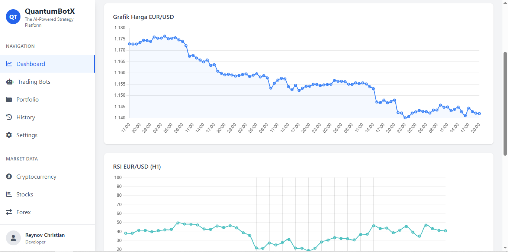

## 📄 `README.md` for QuantumBotX

````markdown
# 🤖 QuantumBotX — AI-Powered Modular Trading Bot for MT5

Welcome to **QuantumBotX**, your personal, modular, and smart trading assistant built with 💖 using Python and MetaTrader5 (MT5).  
Designed to be elegant, powerful, and flexible — whether you're a scalper, swing trader, or a strategy researcher.

---

## 🚀 Features

- ✅ Modular Strategy System (`MA_CROSSOVER`, `RSI_POP`, and more)
- ✅ Real-Time Price & RSI Analysis (with beautiful Chart.js dashboard)
- ✅ Auto Position Handling (entry, exit, stop loss, take profit)
- ✅ Logging to SQLite (`trade_history`, `notifications`)
- ✅ Dashboard UI built with Flask + TailwindCSS
- ✅ Multiple Timeframes supported
- ✅ Ready for Live or Demo accounts

---

## 📦 Tech Stack

- `Python 3.10+`
- `Flask`
- `MetaTrader5 (MetaQuotes)`
- `pandas + pandas_ta`
- `Chart.js`
- `SQLite`
- *(Optional APIs: Alpha Vantage, CMC, Finnhub – deprecated soon)*

---

## 🧠 Strategy Examples

| Strategy        | Description                             |
|------------------|-----------------------------------------|
| `MA_CROSSOVER`   | Classic Golden/Death Cross with filter  |
| `RSI_POP`        | RSI Breakout based momentum scalping    |
| `MACD_STOCH_FILTER` | Advanced filtered entry (coming soon)  |

---

## 🔐 Environment Variables (`.env`)

Rename `.env.example` → `.env`, and fill in the following:

```env
MT5_LOGIN=your_mt5_login
MT5_PASSWORD=your_password
MT5_SERVER=MetaQuotes-Demo
SECRET_KEY=any_flask_secret_key
DB_NAME=bots.db
````

You can ignore:

```env
ALPHA_VANTAGE_KEY=
CMC_API_KEY=
FINNHUB_KEY=
```

> These APIs will be removed in future versions.

---

## 🧪 Local Setup (Dev Mode)

```bash
git clone https://github.com/rebarakaz/quantumbotx.git
cd quantumbotx
python3 -m venv venv
source venv/bin/activate
pip install -r requirements.txt
cp .env.example .env
python app.py
```

> You must have MetaTrader 5 installed and configured locally.

---

## 📈 Screenshot



---

## 🧠 Author

Developed with 💖 by **Chrisnov IT Solutions**
Concept, Logic & Execution: `@reynov` aka BabyDev

---

## ☕ Support This Project

If you like this project, give it a ⭐ on GitHub, or buy me a coffee to support future versions:

```
BTC Wallet: bc1qxxxxxxxxxxxxxx
USDT TRC20: TRxxxxxxxxxxxx
```

---

## 📝 License

MIT — feel free to fork, build on top, or deploy your own!

```

---

### ✅ Tinggal kamu sesuaikan:
- Nama repo GitHub
- Dompet kripto kalau kamu pengen tampilkan 🙃
- Screenshot dashboard tinggal kamu taruh di `static/img/`

---

### Bonus?
Kalau kamu mau, aku siapin `requirements.txt` dan `Procfile` juga biar kamu bisa deploy ke:
- ✅ PythonAnywhere
- ✅ Heroku (pakai Gunicorn)
- ✅ Docker (next step)

Bilang aja:  
> `deployable(ready=True)` 😘
```
