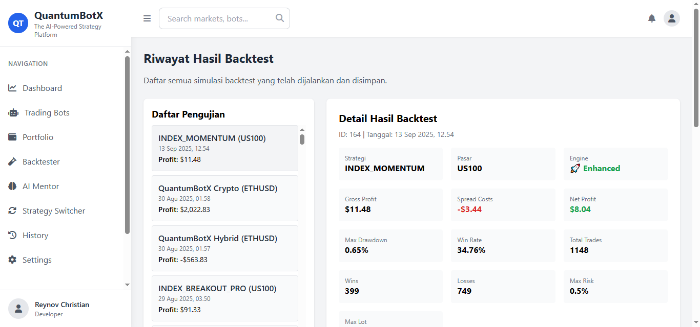

# 🤖 QuantumBotX — AI-Powered Modular Trading Bot for MT5

!MIT License
!Python Version
!Framework
!Made with Love

Welcome to **QuantumBotX**, your personal, modular, and smart trading assistant built with Python and MetaTrader5 (MT5).
Designed to be elegant, powerful, and flexible — whether you're a scalper, swing trader, or a strategy researcher.

---

## 🚀 Features

### 🎯 **Core Trading Engine**
- ✅ **Modular Strategy System**: 16+ professional trading strategies with plug-and-play architecture
- ✅ **ATR-Based Risk Management**: Dynamic position sizing that adapts to market volatility with realistic backtesting
- ✅ **Advanced Backtesting Engine**: Realistic spread/slippage modeling with instrument-specific configurations
- ✅ **Multi-Broker Support**: Automatic symbol migration (XM Global, MetaTrader, Exness, Alpari, FBS)
- ✅ **Real-Time Trading**: 4 concurrent bots with live MT5 integration and smart symbol validation
- ✅ **Emergency Protection**: XAUUSD safeguards with auto-halting and account blowout prevention
- ✅ **Strategy Switcher**: AI-powered automatic strategy switching based on market conditions
- ✅ **Market Condition Detector**: Real-time market regime analysis (trending/ranging/volatile)

### 🧠 **AI-Powered Mentorship**
- ✅ **Indonesian AI Mentor**: Personal trading mentor dengan bahasa Indonesia, analisis emosi vs performa
- ✅ **Cultural Intelligence**: Supportif seperti mentor manusia dengan konteks budaya Indonesia
- ✅ **Personalized Guidance**: Analisis pola trading, evaluasi risiko, dan rekomendasi strategi
- ✅ **Motivational Support**: Pesan motivasi yang contextual berdasarkan journey dan performa
- ✅ **Database Integration**: Log semua trade untuk analisis AI dan feedback yang lebih baik

### 🎓 **Educational Framework**
- ✅ **Beginner-Friendly System**: Progressive learning path from Week 1 to Month 3
- ✅ **Strategy Difficulty Ratings**: 2-12 complexity scale with automatic recommendations
- ✅ **Parameter Education**: Every setting explained in plain English
- ✅ **Market-Specific Guidance**: Different strategies for FOREX vs GOLD vs CRYPTO vs INDICES
- ✅ **Built-in Mentorship**: Strategy selector guides users by experience level
- ✅ **Database Migration System**: Seamless version upgrades with `migrate_db.py`

### 📊 **Advanced Analytics**
- ✅ **Comprehensive Backtester**: Historical testing with interactive Chart.js visualizations
- ✅ **Performance Tracking**: Detailed trade logs, equity curves, and profit analysis
- ✅ **Real-Time Dashboard**: Live data visualization and bot monitoring
- ✅ **Backtest History**: Complete archive of all strategy tests with parameters
- ✅ **Risk Analytics**: Drawdown analysis and portfolio performance metrics

### 🌐 **Multi-Asset Trading**
- ✅ **Forex Optimization**: EURUSD, GBPUSD, USDJPY with trend-following strategies
- ✅ **Gold Trading Protection**: Ultra-conservative XAUUSD position sizing with ATR limits
- ✅ **Crypto Excellence**: Bitcoin/Ethereum bots with 24/7 weekend trading mode
- ✅ **Indonesian Market Ready**: XM Indonesia integration with IDR pairs support
- ✅ **Cross-Platform Foundation**: cTrader, Interactive Brokers architecture

### 🎉 **Culturally-Aware Features**
- ✅ **Automatic Holiday Detection**: Christmas and Ramadan modes activate automatically
- ✅ **Ramadan Trading Mode**: Respects prayer times with automatic trading pauses
- ✅ **Cultural Sensitivity**: UI themes and greetings for both Christian and Muslim traders
- ✅ **Islamic Finance Features**: Zakat calculator and charity tracker during Ramadan
- ✅ **Seasonal Adjustments**: Risk management adapts to holiday market conditions

### 🛡️ **Professional Safety**
- ✅ **Automated Risk Control**: 1% max risk per trade with emergency brake system
- ✅ **Volatility Protection**: ATR-based position scaling during market turbulence
- ✅ **Beginner Safeguards**: Parameter validation prevents dangerous settings
- ✅ **Account Preservation**: Conservative defaults protect capital while learning
- ✅ **Windows Optimized**: Clean logging and professional error handling

---

## 🚀 Development & Testing Framework

### 🧪 **Testing Infrastructure**
- ✅ **30+ Test Scripts**: Comprehensive testing suite in dedicated `testing/` directory
- ✅ **Multi-Broker Testing**: XM Global, Exness, Alpari compatibility validation
- ✅ **Strategy Validation**: Individual strategy testing and parameter optimization
- ✅ **ATR Education Testing**: Interactive examples and beginner tutorials
- ✅ **Crypto Integration Tests**: Bitcoin/Ethereum weekend mode validation
- ✅ **Indonesian Market Tests**: XM Indonesia and IDR pairs testing
- ✅ **Risk Management Tests**: XAUUSD protection and ATR-based sizing validation

### 🔧 **Development Tools**
- ✅ **Symbol Migration Tools**: Automatic broker symbol discovery and mapping
- ✅ **Bot State Management**: Debug and fix tools for bot recovery
- ✅ **Performance Analysis**: Backtesting debugging and optimization tools
- ✅ **Market Diagnostics**: Real-time market condition analysis
- ✅ **Integration Demos**: Complete workflow demonstrations

> **Note**: All testing scripts are excluded from git repository for clean production deployment

---

## 📦 Tech Stack

- `Python 3.10+`
- `Flask` & `TailwindCSS`
- `MetaTrader5` Python Integration
- `pandas` & `pandas-ta` for data analysis
- `Chart.js` for data visualization
- `SQLite` for database

---

## 🧠 Strategy Collection

### 🎓 **Beginner Strategies (Complexity 2-3/10)**
| Strategy | Description | Best For | Learning Focus |
|---|---|---|---|
| `MA Crossover` | Classic Golden/Death Cross with beginner-safe defaults | EURUSD, trending markets | Understanding trend following |
| `RSI Crossover` | Momentum analysis with RSI and moving average confirmation | FOREX pairs, momentum learning | Momentum concepts and timing |
| `Turtle Breakout` | Price breakout above/below recent highs/lows | Gold, trending markets | Support/resistance levels |

### 📚 **Intermediate Strategies (Complexity 4-7/10)**
| Strategy | Description | Best For | Advanced Features |
|---|---|---|---|
| `Bollinger Reversion` | Mean reversion when price touches Bollinger Bands | Ranging FOREX markets | Market cycle understanding |
| `Ichimoku Cloud` | Japanese technical analysis with cloud confirmation | FOREX, comprehensive analysis | Multi-indicator synthesis |
| `Pulse Sync` | Multi-timeframe MACD + Stochastic confirmation | FOREX, Gold | Multiple timeframe analysis |
| `Bollinger Squeeze` | Volatility compression breakout detection | Gold, volatile markets | Volatility analysis |

### 🎆 **Advanced Strategies (Complexity 5-8/10)**
| Strategy | Description | Best For | Professional Features |
|---|---|---|---|
| `Quantum Velocity` | EMA 200 + Bollinger Squeeze breakout system | Gold, crypto | Advanced volatility filtering |
| `Mercy Edge` | AI-enhanced multi-timeframe with trend validation | FOREX, Gold | Professional-grade confirmation |
| `QuantumBotX Hybrid` | ADX-adaptive strategy switching (trending vs ranging) | All markets | Market regime detection |
| `Dynamic Breakout` | Adaptive breakout detection with volatility scaling | Gold, crypto | Dynamic parameter adjustment |

### 🚀 **Expert Strategies (Complexity 10-12/10)**
| Strategy | Description | Best For | Specialized Features |
|---|---|---|---|
| `QuantumBotX Crypto` | Bitcoin/Ethereum optimized with 24/7 weekend mode | BTCUSD, ETHUSD | Crypto volatility management |

### 📊 **Index Strategies (NEW!)**
- ✅ **Index Momentum**: Stock index momentum with gap detection for US500, US30
- ✅ **Index Breakout Pro**: Professional index breakout with institutional analysis
- ✅ **Multi-Timeframe Analysis**: Daily, weekly, and monthly perspective for indices
- ✅ **Risk-Adjusted Position Sizing**: Conservative approach for volatile index markets

### 🎯 **Market-Specific Optimization**
- **FOREX Trading**: MA Crossover, Ichimoku Cloud, Bollinger Reversion
- **Gold (XAUUSD)**: Quantum Velocity, Turtle Breakout, Dynamic Breakout
- **Cryptocurrency**: QuantumBotX Crypto, RSI Crossover with crypto detection
- **Stock Indices**: Index Momentum, Index Breakout Pro (US30, US100, US500, DE30, etc.)
- **Multi-Asset**: QuantumBotX Hybrid adapts automatically to any market

---

## 📈 Roadmap

### ✅ **v2.0 - Professional Foundation (COMPLETED)**
- ✅ **ATR-Based Risk Management**: Revolutionary position sizing system
- ✅ **Multi-Broker Symbol Migration**: Automatic XM/Exness/Alpari compatibility
- ✅ **Educational Framework**: Progressive learning system for beginners
- ✅ **Gold Protection System**: Ultra-safe XAUUSD trading with automatic limits
- ✅ **Crypto Weekend Mode**: 24/7 Bitcoin/Ethereum trading capabilities
- ✅ **Strategy Complexity Ratings**: 2-12 scale with automatic recommendations
- ✅ **Windows Optimization**: Clean logging and professional error handling
- ✅ **Comprehensive Backtesting**: Interactive Chart.js visualizations
- ✅ **Indonesian Market Support**: XM Indonesia integration with IDR pairs
- ✅ **Culturally-Aware Trading**: Automatic holiday detection for Christmas and Ramadan

### 🚧 **v2.1 - Intelligence Enhancement (IN DEVELOPMENT)**
- [ ] **Advanced Strategy**: `MACD_STOCH_FILTER` for more precise, filtered entries
- [ ] **Telegram Notifications**: Real-time alerts for trades, errors, and performance
- [ ] **Portfolio Analytics**: Advanced performance metrics and drawdown analysis
- [ ] **Smart Parameter Optimization**: AI-assisted strategy parameter tuning
- [ ] **Market Regime Detection**: Automatic strategy switching based on market conditions
- [ ] **Risk Analytics Dashboard**: Real-time risk exposure and correlation analysis

### 🚀 **v3.0 - AI Revolution (FUTURE VISION)**
- [ ] **Machine Learning Integration**: AI-powered strategy optimization
- [ ] **Sentiment Analysis**: News and social media sentiment trading signals
- [ ] **Multi-Broker Arbitrage**: Cross-broker price difference exploitation
- [ ] **Advanced Portfolio Management**: Multi-strategy portfolio optimization
- [ ] **Custom Strategy Builder**: Visual drag-and-drop strategy creation
- [ ] **Community Strategy Marketplace**: Share and download user strategies

---

## 🔐 Environment Variables (`.env`)

Rename `.env.example` to `.env`, and fill in the following:

```env
MT5_LOGIN="your_mt5_login"
MT5_PASSWORD="your_password"
MT5_SERVER="your_broker_server"
SECRET_KEY="any_flask_secret_key"
DB_NAME=bots.db
```

> **Note:** The API keys for Alpha Vantage, CMC, and Finnhub are deprecated and can be ignored.

---

## 🧪 Local Setup (Dev Mode)

1.  **Clone the repository:**
    ```bash
    git clone https://github.com/rebarakaz/quantumbotx.git
    cd quantumbotx
    ```
2.  **Set up Python virtual environment:**
    ```bash
    python -m venv venv
    # On Windows
    .\venv\Scripts\activate
    # On macOS/Linux
    source venv/bin/activate
    ```
3.  **Install dependencies:**
    ```bash
    pip install -r requirements.txt
    ```
4.  **Configure your environment:**
    ```bash
    cp .env.example .env
    # Now, edit the .env file with your MT5 credentials
    ```
5.  **Run the application:**
    ```bash
    python run.py
    ```
6.  **Development & Testing (Optional):**
    ```bash
    # Explore 30+ test scripts in testing/ directory
    # Test specific strategies, brokers, or market conditions
    # All testing scripts are automatically excluded from git
    ```

> **Important:** You must have the MetaTrader 5 terminal installed and running on the same machine.
> **Linux Users:** MetaTrader 5 is Windows-only, but you can run it on Linux using Wine. See the Linux Setup section below for detailed instructions.
> **For Developers:** Check the `testing/` directory for comprehensive test scripts and development tools.

---

## 🐧 Linux Setup (Wine Configuration)

Since MetaTrader 5 is Windows-only software, Linux users need to use Wine to run MT5. Here's a step-by-step guide:

### 1. Install Wine
```bash
# Ubuntu/Debian
sudo apt update
sudo apt install wine winetricks

# Fedora/CentOS/RHEL
sudo dnf install wine winetricks

# Arch Linux
sudo pacman -S wine winetricks
```

### 2. Configure Wine Environment
```bash
# Create a new Wine prefix for MT5 (recommended for isolation)
export WINEPREFIX="$HOME/.wine-mt5"
wineboot --init

# Install required Windows components
winetricks corefonts vcrun2019 dotnet48
```

### 3. Download and Install MetaTrader 5
```bash
# Download MT5 installer from your broker's website
# Example for XM Global:
wget https://download.mql5.com/cdn/web/metaquotes.software.corp/mt5/xmglobal5setup.exe

# Install MT5 using Wine
wine xmglobal5setup.exe
```

### 4. Configure Python Environment
```bash
# Set up the project as usual
git clone https://github.com/rebarakaz/quantumbotx.git
cd quantumbotx
python -m venv venv
source venv/bin/activate
pip install -r requirements.txt

# Configure environment variables
cp .env.example .env
# Edit .env with your MT5 credentials
```

### 5. Run QuantumBotX with Wine
```bash
# Start MT5 in Wine (in background)
export WINEPREFIX="$HOME/.wine-mt5"
wine "$HOME/.wine-mt5/drive_c/Program Files/MetaTrader 5/terminal64.exe" &

# Wait for MT5 to fully load, then start QuantumBotX
python run.py
```

### 6. Troubleshooting Tips
- **MT5 Connection Issues**: Ensure MT5 is fully loaded before starting QuantumBotX
- **Wine Performance**: Use `winecfg` to adjust graphics settings for better performance
- **Font Issues**: Install additional fonts with `winetricks corefonts`
- **Memory Issues**: Increase Wine's virtual memory in `winecfg`

### Alternative: Docker Approach
For advanced users, you can also run MT5 in a Windows container:
```bash
# This requires Docker with Windows container support
# Implementation details depend on your specific setup
```

> **Note**: Wine performance may vary depending on your Linux distribution and hardware. For production trading, consider using a dedicated Windows machine or VM.

---

## 🖥️ System Requirements

### Windows (Native Support)
- Windows 10/11 (64-bit recommended)
- MetaTrader 5 terminal
- Python 3.10 or higher
- Minimum 4GB RAM
- Stable internet connection

### Linux (Wine Required)
- Any modern Linux distribution
- Wine 6.0 or higher
- Python 3.10 or higher
- Minimum 6GB RAM (Wine overhead)
- X11 or Wayland display server

### macOS (Not Officially Supported)
- macOS users may attempt Wine/CrossOver setup
- Consider using Windows VM or Parallels
- Not recommended for production trading

---

## ⚠️ Disclaimer

Trading foreign exchange on margin carries a high level of risk and may not be suitable for all investors. The high degree of leverage can work against you as well as for you. Before deciding to trade, you should carefully consider your investment objectives, level of experience, and risk appetite.

This software is provided "as is" for educational and research purposes. The author is not responsible for any financial losses incurred from using this bot. **Always test thoroughly on a demo account before using on a live account.**

---

## 📈 Screenshot

### Dashboard Preview
Main dashboard showing bot status, performance metrics, and quick access to all features.


### Demo Account View
Example of a demo trading account with risk management settings and strategy configuration.

### Strategy Configuration
Interface for setting up and customizing trading strategies with ATR-based risk management.


### Backtesting Results
Visualization of strategy performance with interactive charts and detailed metrics.


---

## 🧠 Author

Developed with 💖 by **Chrisnov IT Solutions**
Concept, Logic & Execution: `@chrisnov` aka BabyDev

---

## ☕ Support This Project

If you like this project, give it a ⭐ on GitHub, or buy me a coffee to support future versions:

[](https://www.paypal.com/paypalme/rebarakaz)

---

## 📝 License

This project is licensed under the MIT License - see the LICENSE.md file for details.
